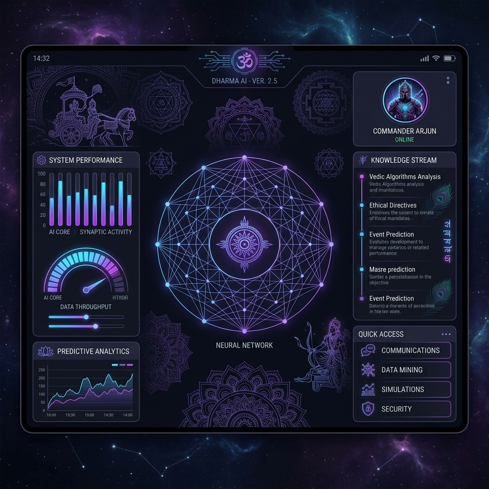
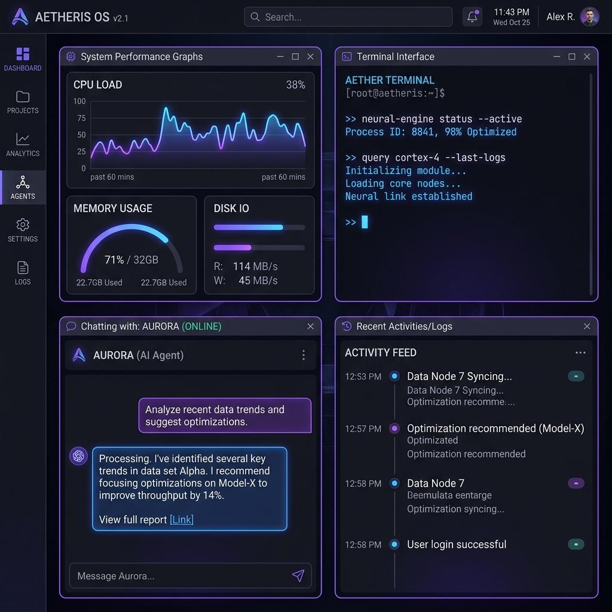
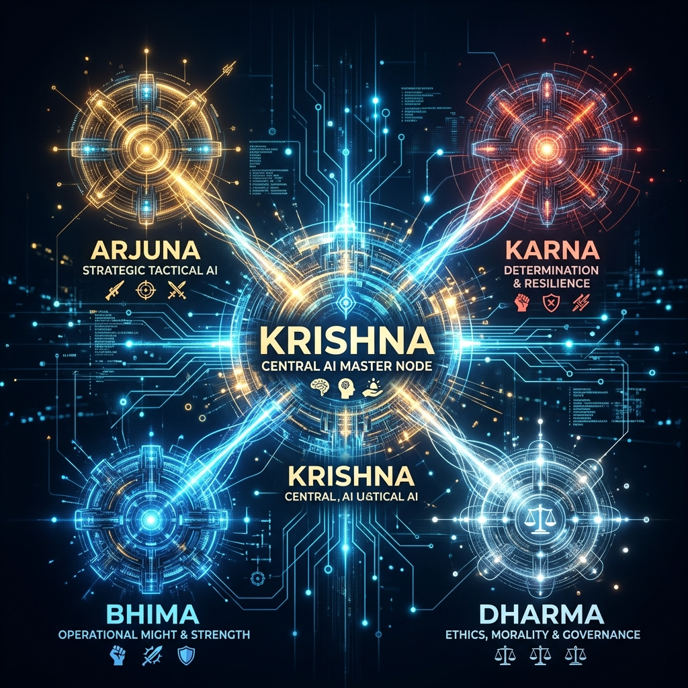

<div align="center">
  

  <h1>🕉️ MAHABHARATA SYSTEM</h1>
  
  <p><strong>A Next-Generation, Local-First Multi-Agent AI Operating System</strong></p>

  <p>
    <a href="https://github.com/yogavinay/KrishnaOS-/stargazers"></a>
    <a href="https://github.com/yogavinay/KrishnaOS-/network/members"></a>
    <a href="https://github.com/yogavinay/KrishnaOS-/issues"></a>
    <a href="https://github.com/yogavinay/KrishnaOS-/blob/main/LICENSE"></a>
  </p>

  <p>
    <a href="#-about-the-project">About</a> •
    <a href="#-the-council-of-agents">The Agents</a> •
    <a href="#-core-features">Features</a> •
    <a href="#%EF%B8%8F-installation">Installation</a> •
    <a href="#-usage-guide">Usage</a>
  </p>
</div>

---

## 📖 About The Project

> **Privacy First. Local Execution. Multi-Agent Intelligence.**

**MAHABHARATA SYSTEM** is a cutting-edge AI Operating System designed to function completely locally, powered by [Ollama](https://ollama.com/). Drawing its architectural inspiration from the ancient Indian epic, the system employs a *Council of Agents*—each heavily specialized in a particular domain—working collaboratively under a master orchestrator.

Whether you need complex code engineering, deep web research, system automation, or just a dynamic conversational partner, the Mahabharata System distributes the workload to the most capable agent, yielding lightning-fast, highly accurate results.

<div align="center">
  
  <p><em>Modern, ultra-sleek web dashboard for seamless interaction</em></p>
</div>

---

## 🤖 The Council of Agents

The true power of this system lies in its multi-agent architecture. Five distinct AI agents operate in harmony.

<div align="center">
  
</div>

| Avatar | Agent Name | Designation | Core Responsibilities |
| :---: | :--- | :--- | :--- |
| 👑 | **KRISHNA** | Master Orchestrator | The Commander. Intercepts user requests, formulates execution plans, and delegates tasks to the optimal sub-agents. Manages the system's main loop. |
| 🏹 | **ARJUNA** | Search & Knowledge | The Researcher. Specializes in browsing the web (via Tavily), scraping documentation, extracting facts, and aggregating knowledge. |
| 💪 | **BHIMA** | System Operator | The Executor. Granted OS-level permissions. Capable of desktop automation, file management, and executing terminal commands safely. |
| 📜 | **DHARMA** | Memory & Personality | The Soul. Maintains the vector database and long-term conversational memory. Ensures the AI retains context across multiple sessions. |
| 🛠️ | **KARNA** | Coder & Engineer | The Builder. Writes flawless code, debugs scripts, configures environments, and solves the most complex software engineering challenges. |

---

## ✨ Core Features

*   **🔒 100% Local & Private:** Powered by local LLMs via Ollama (default: `qwen3:8b`). Your data never leaves your machine unless you explicitly authorize web searches.
*   **🗣️ Immersive Voice Mode:** Experience ultra-responsive interactions with local speech-to-text (**Whisper**) and highly natural text-to-speech (**Edge-TTS**).
*   **🌐 RESTful API & Web Dashboard:** Built on top of **FastAPI**, offering an exquisite, futuristic web interface to monitor and control your AI agents.
*   **⚙️ Seamless OS Integration:** Register the system as a Windows startup service so your AI council is ready the moment your PC boots.
*   **🧩 Extensible & Modular:** Pluggable architecture supports Telegram bots, GitHub Webhooks, and infinite scalable toolsets.

<div align="center">
  
  <p><em>Immersive Voice Control capabilities</em></p>
</div>

---

## 🏗️ Technology Stack

Our architecture leverages the best modern open-source technologies:

| Layer | Technologies Used |
| :--- | :--- |
| **🧠 Inference Engine** | Ollama, Qwen3 (or Llama 3 / Mistral) |
| **🎙️ Audio Processing** | OpenAI Whisper (Local), Edge-TTS |
| **⚡ Backend API** | FastAPI, Uvicorn, Python 3.10+ |
| **🗄️ Database & Memory** | PostgreSQL, SQLAlchemy, Vector Embeddings |
| **🖥️ System Automation** | PyAutoGUI, psutil, OS Subprocess |
| **🔍 External Search** | Tavily API |

---

## ⚙️ Installation

Ready to bring the council online? Follow these simple steps:

### 1. Prerequisites
- [Python 3.10+](https://www.python.org/downloads/)
- [Ollama](https://ollama.com/) installed and running on your system.
- PostgreSQL (or rely on SQLite fallback if configured).

### 2. Clone & Install
```bash
# Clone the repository
git clone https://github.com/yogavinay/KrishnaOS-.git
cd KrishnaOS-

# Install required Python dependencies
pip install -r requirements.txt
```

### 3. Environment Configuration
```bash
# Copy the example environment file
cp .env.example .env
```
Open `.env` and fill in your details (e.g., `OLLAMA_MODEL`, `TAVILY_API_KEY`, `DATABASE_URL`).

---

## 🎮 Usage Guide

You can launch the Mahabharata System in multiple ways depending on your needs.

### 💻 Quick Start (Windows)
Just double-click the included `startup.bat` file. This automatically:
1. Starts the Ollama server.
2. Boots the FastAPI backend.
3. Opens the beautiful web dashboard in your browser.

### ⌨️ Terminal Commands
Alternatively, use `main.py` directly from your terminal:

```bash
# Start in standard interactive text mode
python main.py

# Start the API server and dashboard ONLY (http://localhost:8000)
python main.py --api

# Start in immersive voice interactive mode
python main.py --voice

# Register the system to run silently on Windows startup
python main.py --register
```

---

<div align="center">
  <p>Built with ❤️ for the open-source AI community.</p>
  <p><em>"Whenever there is a decline in intelligence, and an upsurge of ignorance, then I manifest Myself."</em></p>
</div>
